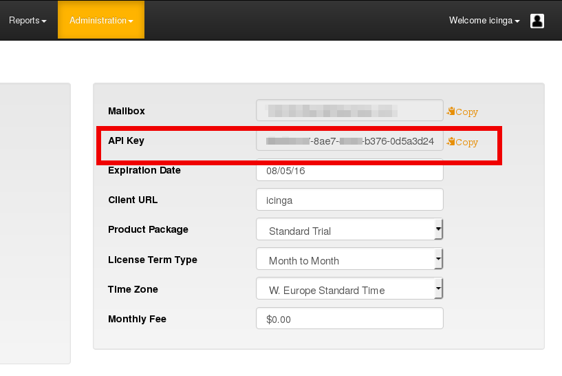

# Icinga 2 AlertOps Integration

[AlertOps](http://alertops.com/) is a collaborative incident
management solution that integrates multi-modal communication,
application monitoring, change management and SLAs (service-level
agreements). This notification script uses the [AlertOps Generic REST
API](http://help.alertops.com/default.aspx/MyWiki/Generic%20REST%20API.html)
to send alerts reported by Icinga 2 to your AlertOps account. Based
on your ruleset incidents can be automatically opened and closed,
depending on whether Icinga reports a problem or a recovery.

## Prerequisites

This script requires Icinga 2.0.0 or later.

### Perl packages

These libraries are used by the notification command:

* HTTP::Request::Common
* LWP::UserAgent
* JSON

If you're using Debian or Ubuntu, install the following packages:

    # apt-get install -y libhttp-message-perl libwww-perl libjson-perl cpanminus

If you're running openSUSE, install the following packages:

    # zypper install perl-App-cpanminus perl-JSON

On CentOS install the following packages plus dependencies:

    # yum install perl-libwww-perl perl-App-cpanminus

Next, check out this GitHub repository and change into the
`icinga2-notification-alertops` directory:

```
   # cd ~
   # git clone https://github.com/Icinga/icinga2-notification-alertops.git
   # cd icinga2-notification-alertops
```

There is a `cpanminus` script (`cpanfile`) that contains a list of
all Perl dependencies. Use the following command to check for missing
CPAN modules and to install them in one go:

    # cpanm --verbose --installdeps .


> **Note**
>
> If you see an error message like `Can't locate Parse/PMFile.pm` on
> openSUSE Leap 42.1, you've probably run into [this
> bug](https://bugzilla.suse.com/show_bug.cgi?id=983472). One solution
> is to fetch the missing module from the [CPAN server](http://www.cpan.org/authors/id/I/IS/ISHIGAKI/Parse-PMFile-0.40.tar.gz),
> unpack the archive and copy the file `PMFile.pm` manually to `/usr/lib/perl5/5.18.2/Parse`.
> Next, run the `cpanm` command again.

## Icinga 2 Configuration

Change into the `/etc/icinga2/conf.d` directory and create a new
configuration file, e.g. `alertops.conf`. Define a user object, a
notification command, two `Notification` objects (one for hosts and
one for services). (Alternatively, you can add the snippets to the
corresponding files on your Icinga 2 installation.)

### User object

The user object defines where your notifications will be sent to.
Apart from the `display_name` (a short description of the user),
one or more groups (`groups`), a set of state and type filters that
specifies when the notification should be triggered (`states`,
`types`), you need to configure your personal AlertOps API key. You
can find it in the AlertOps dashboard in the menu **Administration
-> Subscription Settings**.



```
object User "alertops" {
  display_name = "AlertOps Notification User"
  groups = [ "icingaadmins" ]
  states = [ OK, Warning, Critical, Unknown ]
  types = [ Problem, Recovery ]

  vars.alertops_apikey = "a2ed82a783te7-4335-h378-0d2a5d1a7b64"
}
```

Learn more about user objects in the [Icinga 2 Docs](http://docs.icinga.org/icinga2/latest/doc/module/icinga2/chapter/object-types#objecttype-user).

### NotificationCommand

The notification command defines the location and parameters of
this script. The variables you enter here will be used in in the
notification rules later (see [Notification
configuration](README.md#notifications-config)). This command
expects the notification script `alertops_notification.pl` in the
directory `/etc/icinga2/scripts`:

    # cp ~/icinga2-notification-alertops/alertops_notification.pl /etc/icinga2/scripts/

The configuration for the `NotificationCommand` can look like this:

```
object NotificationCommand "alertops-notification" {
  import "plugin-notification-command"
  command = [ SysconfDir + "/icinga2/scripts/alertops_notification.pl" ]

  env = {
    "ALERTOPS_APIKEY" = "$user.vars.alertops_apikey$"
  }

  arguments = {
          "--source"      = "$alertops_source$",
          "--source_name" = "$alertops_source_name$",
          "--subject"     = "$alertops_subject$",
          "--status"      = "$alertops_state$",
          "--incident"    = "$alertops_incident$",
          "--severity"    = "$alertops_severity$",
          "--url"         = "$alertops_url$",
          "--short_text"  = "$alertops_short_text$",
          "--long_text"   = "$alertops_long_text$",
          "--assignee"    = "$alertops_assignee$"
  }
}
```

Learn more about the NotificationCommand object in the [Icinga 2 Docs](http://docs.icinga.org/icinga2/latest/doc/module/icinga2/chapter/object-types#objecttype-notificationcommand).

### <a id="notifications-config"></a> Notifications

Next, create the two `Notification` objects, one for hosts and one for
services. Define the command that sends out the notifications, the
`User` object that you have created before (e.g. `alertops`), the
time period, and the states. For `Host` objects the state can be `Up` or
`Down`, services can have the states `OK`, `Warning`, `Critical`,
and `Unknown`. Additionally, enter one or more types, i.e. `Problem`,
`Acknowledgement`, or `Recovery`.

#### Hosts

```
apply Notification "alertops-host" to Host {
  command = "alertops-notification"
  users = [ "alertops" ]
  period = "24x7"
  states = [ Up, Down ]
  types = [ Problem, Acknowledgement, Recovery ]

  vars.alertops_source = "Icinga2"
  vars.alertops_source_name = "Icinga2-Host"
  vars.alertops_subject = "$host.name$ - $host.state$"
  vars.alertops_incident = "$host.name$"
  vars.alertops_long_text = "Host $host.name$ is $host.state$!"
  vars.alertops_state = "$host.state$"

  assign where host.vars.notify_alertops == true
}
```

#### Services

```
apply Notification "alertops-service" to Service {
  command = "alertops-notification"
  users = [ "alertops" ]
  period = "24x7"
  states = [ OK, Warning, Critical, Unknown ]
  types = [ Problem, Acknowledgement, Recovery ]

  vars.alertops_source = "Icinga2"
  vars.alertops_source_name = "Icinga2-Service"
  vars.alertops_subject = "$host.name$ - $service.name$ - $service.state$"
  vars.alertops_incident = "$host.name$ - $service.name$"
  vars.alertops_long_text = "Service $service.name$ on host $host.name$ is $service.state$!"
  vars.alertops_state = "$service.state$"

  assign where service.vars.notify_alertops == true
}
```

#### Variable for hosts/services

In order to enable a host or service to communicate with AlertOps and
send the alerts, add the previously configured custom variable:

```
vars.notify_alertops = true
```

### Restart Icinga 2

After saving the configuration file and adding the custom variable
`vars.notify_alertops` to a host or service object, please restart
Icinga 2:

    # systemctl restart icinga2

## <a id="alert-ops-config"></a> AlertOps Configuration

AlertOps expects you to write rulesets to identify your alerts and
create incidents based on multiple parameters. To do so, open the
menu **Administration -> Inbound Integrations**. Since host and
services have different states, you need to define distinctive
rules. Here are two different examples, one for hosts and one for
services:

### Icinga Host Alerts

| Option                  | Value           | 
| :---------------------- | :-------------- |
| Integration Name        | Icinga2 Hosts   |
| Source                  | Icinga2         |
| Source-Name             | Icinga2-Host    |
| Status Field            | SourceStatus    |
| Open Alert on Value     | DOWN            |
| Close Alert on Value    | UP              | 

### Icinga Service Alerts

| Option                  | Value              | 
| :---------------------- | :-------------- |
| Integration Name        | Icinga2 Services   |
| Source                  | Icinga2            |
| Source-Name             | Icinga2-Service    |
| Status Field            | SourceStatus       |
| Open Alert on Value     | CRITICAL           |
| Close Alert on Value    | OK                 | 

*See the screenshots for some real use case impressions.* For more
information on the AlertOps web interface, please refer to the [AlertOps
documentation](http://alertops.com/documentation).
